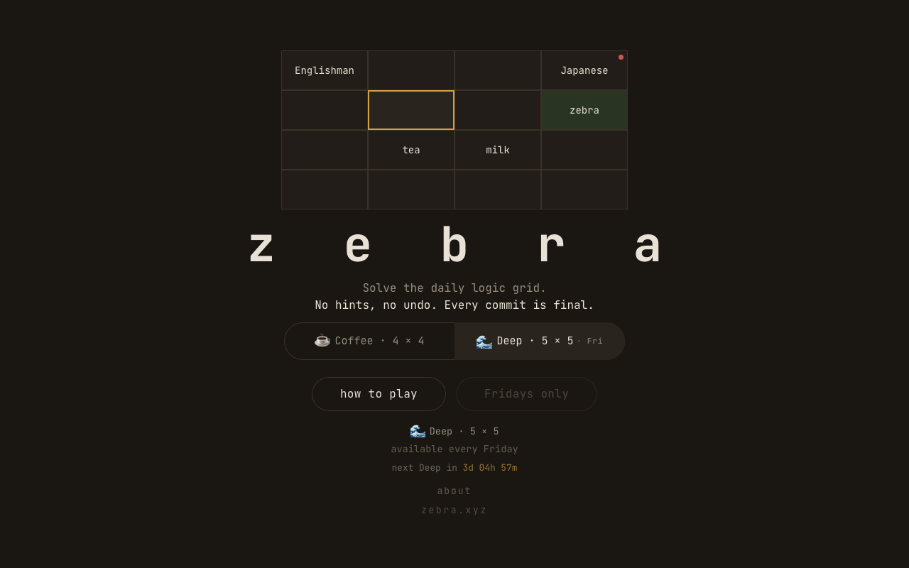
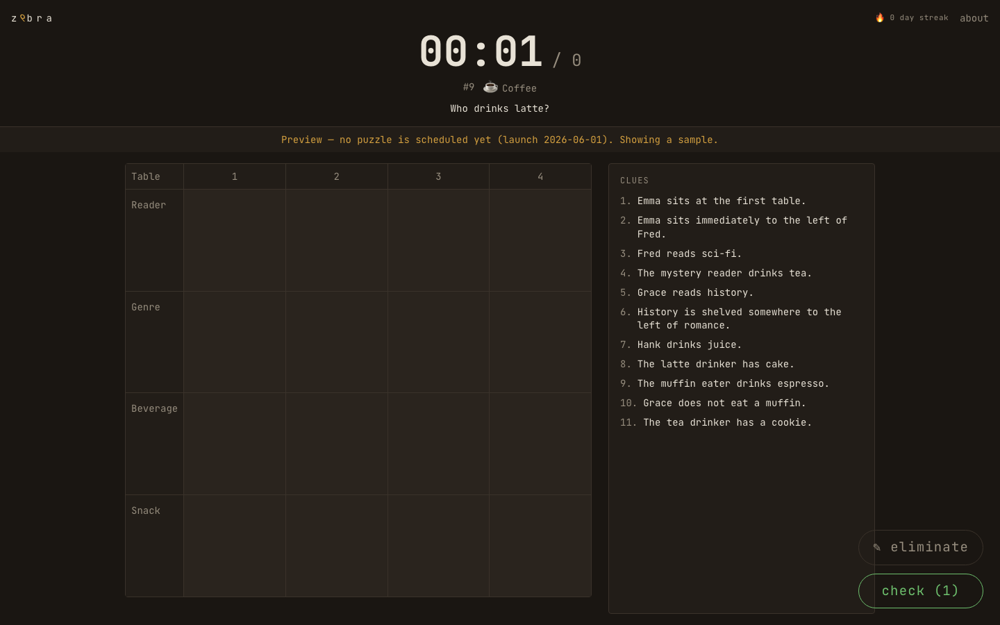
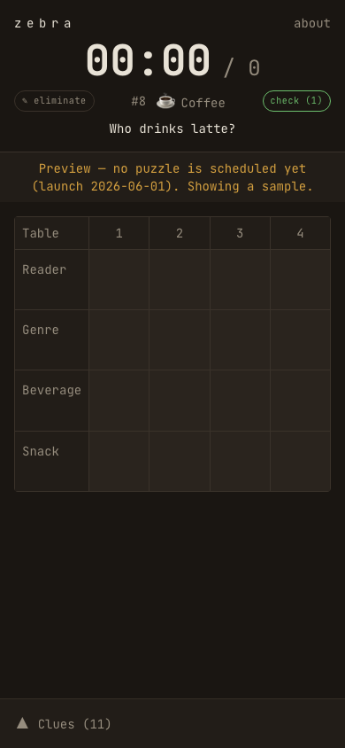

# z9bra

The Einstein ("zebra") riddle as a daily puzzle. One per day, one hard timer,
one score: how many times you changed a committed cell. Zero is Flawless.

Good for waking your brain up in the morning.

**[zebra9.xyz](https://zebra9.xyz)**

---

## Screenshots

<table>
  <tr>
    <td align="center"><b>Landing</b></td>
    <td align="center"><b>Puzzle (desktop)</b></td>
  </tr>
  <tr>
    <td></td>
    <td></td>
  </tr>
  <tr>
    <td align="center"><b>Puzzle (mobile)</b></td>
    <td align="center"></td>
  </tr>
  <tr>
    <td></td>
    <td></td>
  </tr>
</table>

---

## How it works

You get one puzzle per day. Read the clues, fill the grid, and submit before the
clock runs out. The timer starts when you click start.

Scoring is just the overwrite count: how many times you changed a cell after
committing a value. No streaks shown in-game, no partial credit.

**Tracks**

| Track | Grid | Timer | Cadence |
|---|---|---|---|
| ☕ Coffee | 4 × 4 | 10 min | Daily |
| 🌊 Deep | 5 × 5 | 25 min | Fridays only |

**Input modes**

- Commit: tap a cell, pick a value from the options panel. Changing it later adds to your score.
- Eliminate: cross out values you've ruled out. They stay crossed in the picker when you reopen the cell.
- Note: pin candidate values as small annotations in the cell corner.
- Check (one use): verify one committed cell against the answer. The result is permanent and highlighted for the rest of the session. The row containing the puzzle's question is blocked, so you can't check adjacent cells to narrow down the answer by elimination.

When you finish (or the clock hits zero), a result card shows your time,
overwrite count, and a countdown to the next puzzle. One tap copies a shareable
stat line.

---

## Tech stack

- Next.js 16 (App Router) + React 19, TypeScript strict
- Tailwind CSS v4, dark theme backed by a CSS variable palette
- Vitest for data-layer tests
- ESLint + Prettier
- Deployed on Vercel; no accounts in v1 (localStorage only)

---

## Getting started

You'll need the Node version in [`.nvmrc`](./.nvmrc).

```bash
nvm use
npm install
```

For mobile testing, use the production build. Turbopack dev mode breaks React's
synthetic event system on iOS Safari and `onClick` handlers stop firing.

```bash
npm run build && npm run start -- --hostname 0.0.0.0
# find your local IP: ipconfig getifaddr en0
# open http://<your-ip>:3000 on your phone
```

---

## Scripts

| Script | What it does |
|---|---|
| `npm run build` | Production build |
| `npm run start` | Serve the production build |
| `npm run dev` | Dev server (desktop only, see above) |
| `npm run lint` | ESLint |
| `npm run typecheck` | `tsc --noEmit` |
| `npm run format` | Prettier write |
| `npm run format:check` | Prettier check (CI-friendly) |
| `npm test` | Vitest (watch) |
| `npm run test:run` | Vitest (single run) |

---

## Project structure

```
app/
  page.tsx                 Landing page (track selector + how-to-play)
  play/page.tsx            Daily puzzle session
  about/page.tsx           About
  api/share/[id]/route.ts  Share-card endpoint (PNG via satori, upcoming)
components/
  PlaySession.tsx          Session state: timer, commits, scoring, modes
  PuzzleGrid.tsx           4x4 / 5x5 solving grid
  CellPicker.tsx           Value options panel (commit, eliminate, note, check)
  CluePanel.tsx            Clue list, desktop sidebar
  ClueDrawer.tsx           Clue list, mobile bottom drawer
  ResultScreen.tsx         Win / DNF overlay with countdown and share
  Hud.tsx                  Timer, overwrite count, track badge
  ModeSelector.tsx         Commit / Eliminate / Note mode tabs
lib/
  config.ts                Tracks, reset timezone, launch date
  data/puzzles.ts          Loads + validates the puzzle bundle
  data/selection.ts        Deterministic daily puzzle selection
types/puzzle.ts            TS mirror of the generator export schema (1.0.1)
data/puzzles/v1.json       Puzzle bank (versioned JSON from the generator)
tests/                     Vitest data-layer tests
```

---

## Daily selection

The day's puzzle is determined by the date, not the client. Everyone gets the
same puzzle at the same time, identified by the same `z9bra #N` number. The
reset is midnight `America/Toronto`. The pool is consumed sequentially, so
puzzles don't repeat as long as the bank stays ahead of the cursor. See
`lib/data/selection.ts`.

---

## Puzzle data contract

Puzzles come from a separate Python CSP generator, dropped in as
`data/puzzles/v1.json`. The generator is the source of truth for rendering and
grading. Don't hand-edit exported puzzles. `types/puzzle.ts` mirrors the export
schema (version 1.0.1); `lib/data/puzzles.ts` validates `schema_version` on
load. Minor schema bumps add optional fields; major bumps are breaking changes.

---

## Puzzle generator

Puzzles are generated by [csp-generator](https://github.com/egeyesss/csp-generator), a Python CSP solver I built separately. It produces a versioned JSON bundle that gets dropped into `data/puzzles/v1.json`. The generator is the source of truth for puzzle correctness — this repo just renders and grades what it exports.

---

## License

[MIT](./LICENSE)
